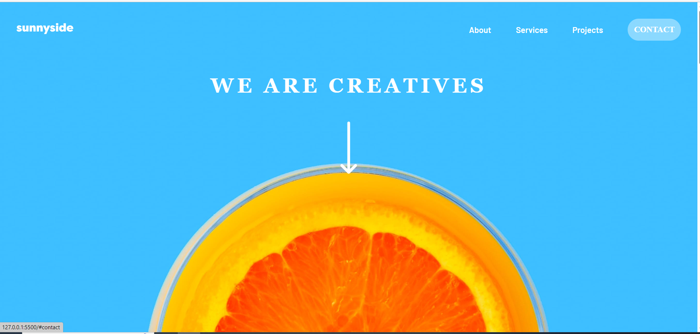

# Frontend Mentor - Sunnyside agency landing page solution

This is a solution to the [Sunnyside agency landing page challenge on Frontend Mentor](https://www.frontendmentor.io/challenges/sunnyside-agency-landing-page-7yVs3B6ef). Frontend Mentor challenges help you improve your coding skills by building realistic projects.

## Table of contents

- [Overview](#overview)
  - [The challenge](#the-challenge)
  - [Screenshot](#screenshot)
  - [Links](#links)
  - [Built with](#built-with)
- [Author](#author)
## Overview

The challenge is mainly to build out this landing page and get it looking as close to the design as possible.

This challenge focuses mostly on HTML & CSS. There's a tiny bit of JS included for the mobile navigation toggle. But you could also choose to do this without JS!

### The challenge

Users should be able to:

- View the optimal layout for the site depending on their device's screen size
- See hover states for all interactive elements on the page

### Screenshot

### Links

- Solution URL: (https://github.com/Oppy09/sunnyside-agency-landing-page-main)
- Live Site URL: (https://oppy09.github.io/sunnyside-agency-landing-page-main/)

### Built with

- Semantic HTML5 markup
- CSS custom properties
- Flexbox
- CSS Grid
## Author
- Frontend Mentor - [@Oppy09](https://www.frontendmentor.io/profile/Oppy09)
- Twitter - [@AderinolaOpemi5](https://www.twitter.com/AderinolaOpemi5)
